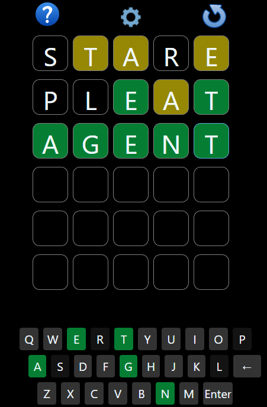

# NOTWordle
This is definitely not a wordle clone. And it's just for fun, so don't sue me.

How To Play
---

There is a 5 letter word. Guess it.
Use the on screen keyboard, or your keyboard to enter a guess.

Start with a word with very common letters.  STARE is my go to.

If the letter is in the right spot, it'll be green.

If the letter is in in the puzzle, but in the wrong spot, it will be yellow.

Press or click Enter to make your guess.

When guessing, it will not submit if: 

- All the letters of a word aren't filled in.

- *Enforce Wordiness* is enabled (on by default) and the word is not a word in my large word list.  At some point I might use an online dictionary to check, but initial tests were quite slow, so for now, this is what you get. 

- *Strict Mode* is enabled (off by default), and the guess doesn't use all previously revealed letters. 

How It's Made
---

Good old plain JS, HTML and CSS (using bootstrap, although mostly just for the modals).

# Changelog

V 1.2.0
---
I figure returning after all this time is worthy of at least a minor version bump. 
Added button to report missing words. 
A few more new words. 
Tweaked the text colour of guessed letters to be darker, as I found it hard to distinguish, even with the background colour different. 

V 1.1.8
---
Fixed bug with multiple losses (yeah it took me this long to figure that out, I rarely lose) where it would only add the next word when it showed you what the word was. 
Some more words added. 

V 1.1.7
---
A few new words
Fixed strict mode display

V 1.1.6
---
Disabled strict mode by default
A few new words
Fixed bug re strict mode not resetting on new game

V 1.1.5
---
Continued adding words.

Added Strict Mode setting.  This allows you to enforce using all previously revealed letters (green or yellow) in any subsequent guesses.  

Minor Refactoring

V 1.1.4
---
Added more words.

If you lose, when it displays the word, it is a link to define it, in case you don't know the word.  

Minor refactoring

V 1.1.3
---
Vastly expanded word list so it detects most words now. 

V 1.1.2
---
Fixed what I broke in 1.1.1, namely being able to submit words...

Added messages

Can now use Enter to trigger Play Again button on modals.

V 1.1.1
---
Added Settings Pane

Added "Wordiness" check.  It's on by default, so you can only guess real words. Not remembered between sessions, might do a cookie later.

Added in-app version number.

V 1.1.0
---
Fixed issue where when backspacing, the 4th letter would remain.  

Prevent submitting word before all letters have been filled.

Prevent interacting with the board after game ends, either because of win or loss. 

Now highlights the current letter.

